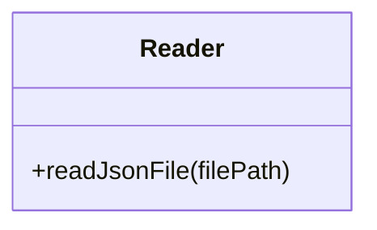
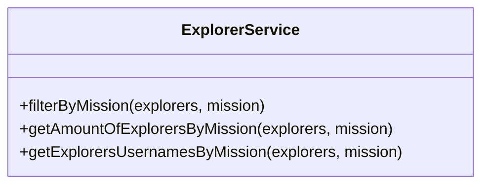
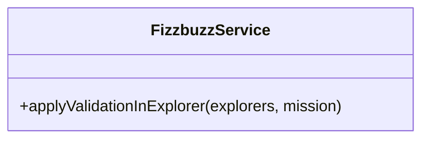
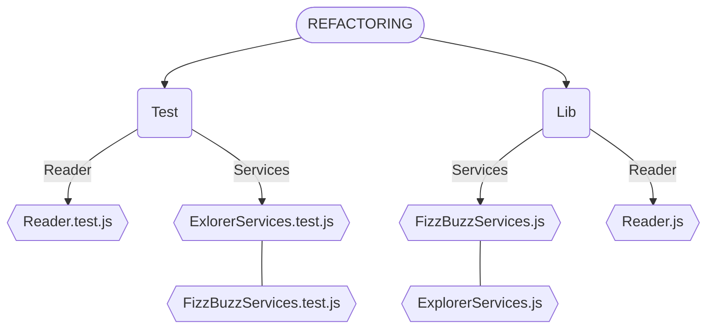
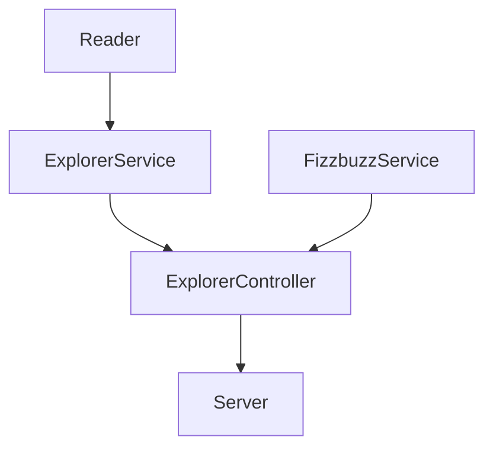
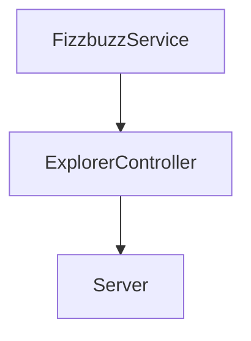

# ⭐️ Semana 4 NodeJS Refactoring 

### 👀 Problema a resolver

Actualmente se necesita calcular cierta información de los explorers de LaunchX, de momento se ha desarrollado por una consultoría externa muy mala un script en JS para realizar esto. Sin embargo después de una evaluación interna se ha decidido refactorizar totalmente el proyecto, y esta es tu primer set de tareas a realizar.

Acontinuacion podemos encontrar los archivos a refactorizar y los requerimientos necesarios a relizar 

<details>
<summary> app.js & explorers.json </summary>

`app.js`
  
```javascript
const fs = require("fs");

// Part 1 Read json file ===========================
const rawdata = fs.readFileSync("explorers.json");
const explorers = JSON.parse(rawdata);

// Part 2: Get the quantity of explorers names in node
const explorersInNode = explorers.filter((explorer) => explorer.mission == "node");
//console.log(explorersInNode.length)

// Part4: Get the explorer's usernames in Node
const explorersInNodeToGetUsernames = explorers.filter((explorer) => explorer.mission == "node");
const usernamesInNode = explorersInNodeToGetUsernames.map((explorer) => explorer.githubUsername);
//console.log(usernamesInNode)

// DEAD CODE: Part 5,6,7, please remove this and go to Part 8!

// Part 5: Get a new list of explorers in node, if the score numbers is divisible by 3, I need a new propery called trick, and the value assigned is FIZZ, if not the value should be the score itself.
// Score: 3, Trick: FIZZ.
// Score: 4, Trick: 4.
// Score: 5, Trick: 5.

const assignFizzTrick = function(explorer){
    if(explorer.score%3 === 0){
        explorer.trick = "FIZZ";
        return explorer;
    }else{
        explorer.trick = explorer.score;
        return explorer;
    }
};

const explorersInNodeAndFizzTrick = explorersInNode.map((explorer) => assignFizzTrick(explorer));

// Part 6: Get a new list of explorers in node if the score number is divisible by 5, we need to set a new property called trick and set the value BUZZ, if not this value should be just the score
//
const assignBuzzTrick = function(explorer){
    if(explorer.score%5 === 0){
        explorer.trick = "BUZZ";
        return explorer;
    }else{
        explorer.trick = explorer.score;
        return explorer;
    }
};

const explorersInNodeAndBuzzTrick = explorersInNode.map((explorer) => assignBuzzTrick(explorer));

//Part7: Get a new list of explorers in Node, if the score number is divisible by 3 AND by 5 we need to set a new property called FIZZBUZZ, if not this value should be the same score value

const assignFizzBuzzTrick = function(explorer){
    if(explorer.score%5 === 0 && explorer.score%3 === 0){
        explorer.trick = "FIZZBUZZ";
        return explorer;
    }else{
        explorer.trick = explorer.score;
        return explorer;
    }
};

const explorersInNodeAndFizzBuzzTrick = explorersInNode.map((explorer) => assignFizzBuzzTrick(explorer));

// Part 8: Get a list of the explorers in node, if the score is divisible by 5 and 3, set the property trick and the value FIZZBUZZ, if is just divisible by 5 set the property trcik and the value BUZZ, if is just divisible by 3 set the property trick and the value FIZZ, otherwise set the property trick and the score value. TODO

```

  `explorers.json`
``` json
[
{
  "name": "Woopa1",
  "githubUsername": "ajolonauta1",
  "score": 1,
  "mission": "node",
  "stacks": [
    "javascript",
    "reasonML",
    "elm"
  ]
},
{
  "name": "Woopa2",
  "githubUsername": "ajolonauta2",
  "score": 2,
  "mission": "node",
  "stacks": [
    "javascript",
    "groovy",
    "elm"
  ]
},
{
  "name": "Woopa3",
  "githubUsername": "ajolonauta3",
  "score": 3,
  "mission": "node",
  "stacks": [
    "elixir",
    "groovy",
    "reasonML"
  ]
},
{
  "name": "Woopa4",
  "githubUsername": "ajolonauta4",
  "mission": "node",
  "score": 4,
  "stacks": [
    "javascript"
  ]
},
{
  "name": "Woopa5",
  "githubUsername": "ajolonauta5",
  "score": 5,
  "mission": "node",
  "stacks": [
    "javascript",
    "elixir",
    "elm"
  ]
},
{
  "name": "Woopa6",
  "githubUsername": "ajolonauta6",
  "score": 6,
  "mission": "java",
  "stacks": [
    "elm"
  ]
},
{
  "name": "Woopa7",
  "githubUsername": "ajolonauta7",
  "mission": "java",
  "score": 7,
  "stacks": [
  ]
},
{
  "name": "Woopa8",
  "githubUsername": "ajolonauta8",
  "score": 8,
  "mission": "java",
  "stacks": [
    "elm"
  ]
},
{
  "name": "Woopa9",
  "githubUsername": "ajolonauta9",
  "score": 9,
  "mission": "java",
  "stacks": [
    "javascript",
    "elixir",
    "groovy",
    "reasonML",
    "elm"
  ]
},
{
  "name": "Woopa10",
  "githubUsername": "ajolonauta10",
  "score": 10,
  "mission": "java",
  "stacks": [
    "javascript",
    "elixir",
    "groovy",
    "reasonML",
    "elm"
  ]
},
{
  "name": "Woopa11",
  "githubUsername": "ajolonauta11",
  "score": 11,
  "mission": "node",
  "stacks": [
    "javascript",
    "elixir",
    "groovy",
    "reasonML",
    "elm"
  ]
},
{
  "name": "Woopa12",
  "githubUsername": "ajolonauta12",
  "score": 12,
  "mission": "node",
  "stacks": [
    "javascript",
    "elixir",
    "groovy",
    "reasonML",
    "elm"
  ]
},
{
  "name": "Woopa13",
  "githubUsername": "ajolonauta13",
  "score": 13,
  "mission": "node",
  "stacks": [
    "javascript",
    "elixir",
    "groovy",
    "reasonML",
    "elm"
  ]
},
{
  "name": "Woopa14",
  "githubUsername": "ajolonauta14",
  "score": 14,
  "mission": "node",
  "stacks": [
    "javascript",
    "elixir",
    "groovy",
    "reasonML",
    "elm"
  ]
},
{
  "name": "Woopa15",
  "githubUsername": "ajolonauta15",
  "score": 15,
  "mission": "node",
  "stacks": [
    "javascript",
    "elixir",
    "groovy",
    "reasonML",
    "elm"
  ]
}
] 
```  
</details>

<details>
  
<summary>  Requerimientos: </summary>
  

1. Refactorizar el script legado y rehacerlo con mucho cuidado ya que es información muy sensible.
2. Crea un API para usar la funcionalidad anterior:

| Endpoint | Request | Response |
|---|---|---|
| `localhost:3000/v1/explorers/:mission` | `localhost:3000/v1/explorers/node` | Deberás obtener la lista de explorers en la misión que enviaste (node o java) |
| `localhost:3000/v1/explorers/amount/:mission` | `localhost:3000/v1/explorers/amount/node` | Deberás obtener la cantidad de explorers según la misión que enviaste (node o java) |
| `localhost:3000/v1/explorers/usernames/:mission` | `localhost:3000/v1/explorers/usernames/node` | Deberás obtener la lista de usernames en la misión que enviaste (node o java) |

3. Nuevo requerimiento: Crea un endpoint para recibir un número y aplicar la validación del fizzbuzz. (ESTO SE DEBE CREAR DESDE CERO)

</details>


# Creación de Proyecto Nuevo de JS

## 👣 *Primeros pasos*

1. Creamos un directorio vacio en nuestra pc llamdo  `Refactoring`.
2. Dentro del directorio inicializamos git con el comando `git init`.
3. Creamos un repo en `Git Hub`.
4. Utilizamos el commando `git remote add origin` + el url del repo creaado.(Esto sincroniza la repo local con la de Git Hub)
6. Dentro del  directorio vacio ejecutamos el comando `npm init`. Este ejecutara un cliente que te preguntará algunos datos de tu proyecto. Es indiferente esta información de momento, puedes darle enter hasta que termine. Al finalizar te creará el archivo package.json. A partir de ahora nuestro directorio es un proyecto de JS. (Así se crea desde cero.)

## ✍ *Agregando dependecia jest*

> Para agregar una dependecia, se necesita  indicar direcrtamente en el `package.json`, este archivo es el corazon de cualquier app de js.

1. Para agregar dependecia podemos usar el comando `npm` y para agregar la ultima vesion de cualquier dependencia utilizamos `npm install --save-dev jest`. (Esto indica que se agrega la dependecia `jest`, y que se agrega para el ambiente de desarrollo `--save-dev`).
2. Verificamos que despues del punto anterior, se haya creado un directorio `node_modules`, este contiene todos los scripts de js de las dependencias. *IMPORTANTE NUNCA VERSIONAR ESTO* . Para no versionar esta carpeta, crea en la RAÍZ de tu proyecto un archivo llamado `.gitignore` y agrega la siguiente línea: `**/node_modules`, con esto vamos a decirle a git que excluya este directorio.

> Realizamos este procedimiento para agregar una nueva dependencia a nuestro proyecto. En este ejemplo agregamos JEST, un framework de testing que nos ayudará a crear nuestras pruebas de unidad. Revisa la documentación de Jest: https://jestjs.io/.

###  ✍🤹‍♀️ *Realizando el primer commit*

1. Para realizar un commit es necesario agregar los archivos con el comando `git add` + el nombre del archivo.
2. Realizamos el commit con el comando `git commit -m "Aqui pones tu comentario"`.
3. A hora solo nos queda subir todo a Git Hub con el comando `git push -u origin master`. 
> es importante realizar muchos commit  ya que esto nos facilita saber que cambios se realizaron en el proyecto.  

### 🏁 *Empezando a refactorizar*

Ahora vamos a tener que modularizar en Orientación a Objetos para darle una mejor estructura.

Crearemos las siguientes clases:

- `Reader` : en esta clase necesitaremos un método static para leer el archivo y obtener la información dado el nombre archivo.
- `ExplorerServices` : aquí vamos tres métodos static para obtener lo que se necesita realizar con la lista de explorers. En este service vamos a realizar todas las operaciones de filtrado y mapeo que se necesiten
- `FizzbuzzService` : aquí haremos un método static para aplicar la validación sobre un explorer y agregarle el campo que se necesita.







La estructura de las carpetas de nuestro proyecto deveria quedar de la siguiente manera


## ✍ 🏠 *Haciendo las clases*

1. Refactor de la lectura del archivo (Reader.js) 

- Crea el archivo y carpetas en `lib/utils/Reader.js`.
- Dentro crea una clase llamada `Reader`.
- Crea un método static llamado `readJsonFile` que reciba un path (este deberá ser el path al archivo a leer).
- Dentro de esta función tendrás que guardar la lógica para leer el archivo y regresar la información (esta lógica ya está en el script inicial).
- No olvides importar el módulo del filesystem `const fs = require("fs");`
- Te dejó aquí cómo deberíamos poder usar tu nuevo servicio para leer un archivo json:

```javascript
const Reader = require("./lib/utils/Reader");
const explorers = Reader.readJsonFile("explorers.json"); // esto regresa la lista de explorers del archivo
```
2. Explorer Service 

Vamos a refactorizar la lógica que se ejecuta sobre la lista de explorers.
- Crea el archivo `lib/services/ExplorerService.js`.
- Crea una clase `ExplorerService`.
- Crea los métodos: `static filterByMission(explorers, mission)`, `static getAmountOfExplorersByMission(explorers, mission)`, `static getExplorersUsernamesByMission(explorers, mission)`.
- No olvides exportar tu clase vía common JS.

Te dejó un ejemplo de cómo vamos a utilizar tu nueva clase en el proyecto:
```javascript
// Clase anterior con la que obtenemos los explorers
const Reader = require("./lib/utils/Reader");
const explorers = Reader.readJsonFile("explorers.json");

// Aplicación del ExplorerService sobre la lista de explorers
ExplorerService.filterByMission(explorers, "node");
ExplorerService.getAmountOfExplorersByMission(explorers, "node");
ExplorerService.getExplorersUsernamesByMission(explorers, "node");
```
3. FizzBuzz Service

Este service necesita mayor lógica por desarrollar, necesitas entender el script legado muy bien.

- Crea un archivo `lib/services/FizzbuzzService.js`
- Crea una clase `FizzbuzzService` y no olvides exportarla.
- Crea un método `static applyValidationInExplorer(explorer)`, este método recibirá un explorer.

Validaciones:
``` javascript
const explorer1 = {name: "Explorer1", score: 1}
FizzbuzzService.applyValidationInExplorer(explorer1) // {name: "Explorer1", score: 1, trick: 1} 

const explorer3 = {name: "Explorer3", score: 3}
FizzbuzzService.applyValidationInExplorer(explorer3) // {name: "Explorer3", score: 3, trick: "FIZZ"}

const explorer5 = {name: "Explorer5", score: 5}
FizzbuzzService.applyValidationInExplorer(explorer5) // {name: "Explorer5", score: 5, trick: "BUZZ"}

const explorer15 = {name: "Explorer15", score: 15}
FizzbuzzService.applyValidationInExplorer(explorer15) // {name: "Explorer15", score: 15, trick: "FIZZBUZZ"}
```

### *Automatización de Pruebas con GitHub Actions*

Si no tienes pruebas no estás autorizado para ninguna entrega ni para avanzar en el proyecto.

1. Crea un nuevo archivo con la ruta: `.github/workflows/test.yml`
2. Copia el siguiente contenido:

```yml
name: Run Tests in my project every push on GitHub

on: [push]

jobs:
  build:
    runs-on: ubuntu-latest
    steps:
    - uses: actions/checkout@v1
    - name: Run Jest
      uses: stefanoeb/jest-action@1.0.3
```

Este es un GitHub Action que automatizará la ejecución de las pruebas cada vez que hagas PUSH a tu repositorio de GitHub.

## 🔍 *Agregando dependecia Linter (Opcional)*


<details>
<summary> Instalacion de Linter </summary>
  
JS y cada lenguaje tienen herramientas para ayudarnos a cuidar la legibilidad en nuestro código, se les conoce como linters. 

1. Instala ESLint en tu proyecto

> npm install eslint --save-dev

2. Ejecuta el comando para generar la configuración del linter:

> npm init @eslint/config

Al finalizar esto te creará un archivo `.eslintrc.js` con la configuración del linter.

3. Agrega tu configuración, haz que tu archivo `.eslintrc.js` se parezca a este:

```javascript
module.exports = {
    "env": {
        "browser": true,
        "commonjs": true,
        "es2021": true,
        "jest": true
    },
    "extends": "eslint:recommended",
    "parserOptions": {
        "ecmaVersion": "latest"
    },
    "rules": {
        indent: ["error", 4],
        "linebreak-style": ["error", "unix"],
        quotes: ["error", "double"],
        semi: ["error", "always"]
    }
};
```

Los rules son reglas que podemos decirle al Linter que revise en nuestros archivos, nos ayudan a detectar mejoras de escritura.

Es indispensable revisar la documentación de cada dependencia que usemos: https://eslint.org/docs/rules/

4. Automatiza los comandos de eslint en tu package.json (recuerda que la ruta dentro de node_modules puede variar en windows)

```
  "scripts": {
    "test": "node ./node_modules/.bin/jest",
    "linter": "node ./node_modules/eslint/bin/eslint.js .",
    "linter-fix": "node ./node_modules/eslint/bin/eslint.js . --fix"
  }
```

5. Ejecuta `npm run linter` para que el linter se ejecute y te diga todas las inconsistencias de escritura.


6. El Linter arregla todos estos detalles por ti. Corre `npm run linter-fix` y tus archivos ahora quedarán con el mejor formato.
</details>

##  🏃‍♂️ *API con express* 

Ahora necesitamos crear otra clase que nos permita extender un puente entre funcionalidad y el server que vamos a crear.


## 🤩 Creando controller para conectar la funcionalidad con el server

1. Crea el archivo `lib/controllers/ExplorerController.js`
2. Importa las clases `ExplorerService`, `FizzbuzzService` y `Reader`.
3. No olvides exportar tu clase.
4. Crea un método para obtener la lista de explorers filtrados por misión:
  - Crea un método static `getExplorersByMission`, recibe un parámetro llamado `mission`. 
  - Dentro de este llama la función del Reader `Reader.readJsonFile("explorers.json")` para obtener la lista de explorers del archivo json.
  - Llama el método de `ExplorerService` para filtrar por misión, usa tu parámetro `mission` y la lista de explorers.
  - Regresa el resultado obtenido.

5. Crea un método `static getExplorersUsernamesByMission(mission)` y regresa la lista de usernames de los explorers filtrados por la misión enviada.
6. Crea un método `static getExplorersAmonutByMission(mission)` y regresa la cantidad de explorers en la misión enviada.

Recuerda que estás funcionalidades ya las tienes, tienes que leer la lista de explorers, y aplicar tus funciones del ExplorerService. No olvides tus pruebas.

## 🌠 Creando server con API
7. Crea un script en `lib/server.js`.
8. Crea un servidor de express.
  - Instala express.
  - Crea un server básico.
  - Ejecuta tu server: `node lib/server.js`
  - Entra en tu navegador a `localhost:3000` y verifica que vez tu mensaje. 
  - Automatiza tu `package.json` para automatizar tu server, agrega la siguiente línea dentro de `scripts`: `"server": "node ./lib/server.js"`. Después solo tendrás que usar `npm run server` para iniciar tu servidor. 
  
`Server Básico server.js`
```javascript
const ExplorerController = require("./controllers/ExplorerController");
const express = require("express");
const app = express();
app.use(express.json());
const port = 3000;

app.get("/", (request, response) => {
    response.json({message: "FizzBuzz Api welcome!"});
});

app.listen(port, () => {
    console.log(`FizzBuzz API in localhost:${port}`);
});
```

9. Importa tu controller. 
10. Crea el primer endpoint para recibir un parámetro por query params, y regresar la lista de explorers filtrados por el parámetro.

## 😎 Flujo de Nueva funcionalidad



De entrada el único punto de conexión que debe haber entre nuestra funcionalidad y el server será el `ExplorerController`. Así vamos a mantener una organización y separación de responsabilidades adecuado. 

Se creará la nueva funcionalidad dentro de `FizzbuzzService`, misma que será usada en el `ExplorerController` y de ahí podrá ser implementada en el server.

1. Crea un nuevo método `static applyValidationInNumber(number){` en `FizzbuzzService`.
  - Implementa la validación de fizzbuzz, solo regresa el valor: "Fizz", "Buzz", "Fizzbuzz" o el mismo número recibido.

2. Crea un nuevo método en `ExplorerController` que reciba un número y use la función del `FizzbuzzService` que acabas de crear.
3. Finalmente usa este método dentro de un nuevo endpoint en el server. Aquí te dejo un ejemplo de cómo se debería ver tu nuevo endpoint:


No olvides agregar pruebas, correr tu linter, subir a GitHub y ver que el Action funcione.
