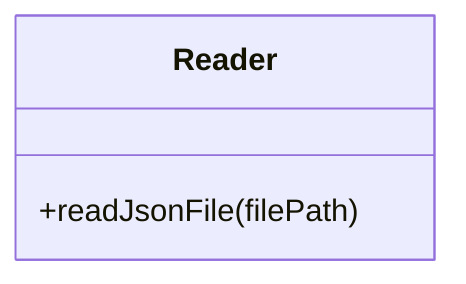
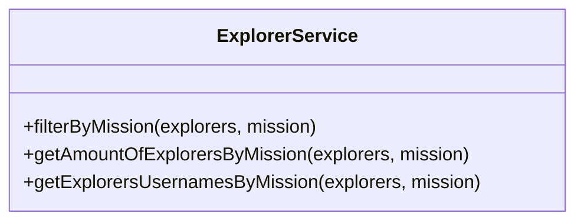
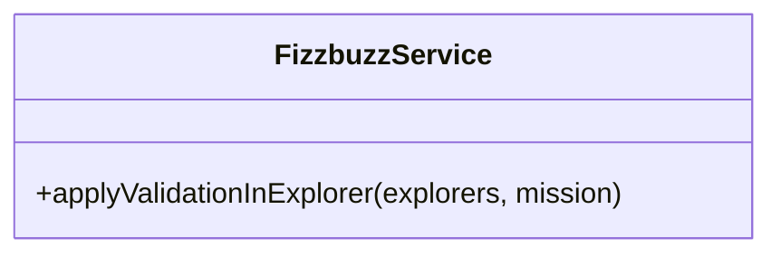

# Semana 4 NodeJS Refactoring 

### Problema a resolver

Actualmente se necesita calcular cierta información de los explorers de LaunchX, de momento se ha desarrollado por una consultoría externa muy mala un script en JS para realizar esto. Sin embargo después de una evaluación interna se ha decidido refactorizar totalmente el proyecto, y esta es tu primer set de tareas a realizar.

Acontinuacion podemos encontrar los archivos a refactorizar y los requerimientos necesarios a relizar 

<details>
<summary> app.js & explorers.json </summary>

`app.js`
  
```javascript
const fs = require("fs");

// Part 1 Read json file ===========================
const rawdata = fs.readFileSync("explorers.json");
const explorers = JSON.parse(rawdata);

// Part 2: Get the quantity of explorers names in node
const explorersInNode = explorers.filter((explorer) => explorer.mission == "node");
//console.log(explorersInNode.length)

// Part4: Get the explorer's usernames in Node
const explorersInNodeToGetUsernames = explorers.filter((explorer) => explorer.mission == "node");
const usernamesInNode = explorersInNodeToGetUsernames.map((explorer) => explorer.githubUsername);
//console.log(usernamesInNode)

// DEAD CODE: Part 5,6,7, please remove this and go to Part 8!

// Part 5: Get a new list of explorers in node, if the score numbers is divisible by 3, I need a new propery called trick, and the value assigned is FIZZ, if not the value should be the score itself.
// Score: 3, Trick: FIZZ.
// Score: 4, Trick: 4.
// Score: 5, Trick: 5.

const assignFizzTrick = function(explorer){
    if(explorer.score%3 === 0){
        explorer.trick = "FIZZ";
        return explorer;
    }else{
        explorer.trick = explorer.score;
        return explorer;
    }
};

const explorersInNodeAndFizzTrick = explorersInNode.map((explorer) => assignFizzTrick(explorer));

// Part 6: Get a new list of explorers in node if the score number is divisible by 5, we need to set a new property called trick and set the value BUZZ, if not this value should be just the score
//
const assignBuzzTrick = function(explorer){
    if(explorer.score%5 === 0){
        explorer.trick = "BUZZ";
        return explorer;
    }else{
        explorer.trick = explorer.score;
        return explorer;
    }
};

const explorersInNodeAndBuzzTrick = explorersInNode.map((explorer) => assignBuzzTrick(explorer));

//Part7: Get a new list of explorers in Node, if the score number is divisible by 3 AND by 5 we need to set a new property called FIZZBUZZ, if not this value should be the same score value

const assignFizzBuzzTrick = function(explorer){
    if(explorer.score%5 === 0 && explorer.score%3 === 0){
        explorer.trick = "FIZZBUZZ";
        return explorer;
    }else{
        explorer.trick = explorer.score;
        return explorer;
    }
};

const explorersInNodeAndFizzBuzzTrick = explorersInNode.map((explorer) => assignFizzBuzzTrick(explorer));

// Part 8: Get a list of the explorers in node, if the score is divisible by 5 and 3, set the property trick and the value FIZZBUZZ, if is just divisible by 5 set the property trcik and the value BUZZ, if is just divisible by 3 set the property trick and the value FIZZ, otherwise set the property trick and the score value. TODO

```

  `explorers.json`
``` json
[
{
  "name": "Woopa1",
  "githubUsername": "ajolonauta1",
  "score": 1,
  "mission": "node",
  "stacks": [
    "javascript",
    "reasonML",
    "elm"
  ]
},
{
  "name": "Woopa2",
  "githubUsername": "ajolonauta2",
  "score": 2,
  "mission": "node",
  "stacks": [
    "javascript",
    "groovy",
    "elm"
  ]
},
{
  "name": "Woopa3",
  "githubUsername": "ajolonauta3",
  "score": 3,
  "mission": "node",
  "stacks": [
    "elixir",
    "groovy",
    "reasonML"
  ]
},
{
  "name": "Woopa4",
  "githubUsername": "ajolonauta4",
  "mission": "node",
  "score": 4,
  "stacks": [
    "javascript"
  ]
},
{
  "name": "Woopa5",
  "githubUsername": "ajolonauta5",
  "score": 5,
  "mission": "node",
  "stacks": [
    "javascript",
    "elixir",
    "elm"
  ]
},
{
  "name": "Woopa6",
  "githubUsername": "ajolonauta6",
  "score": 6,
  "mission": "java",
  "stacks": [
    "elm"
  ]
},
{
  "name": "Woopa7",
  "githubUsername": "ajolonauta7",
  "mission": "java",
  "score": 7,
  "stacks": [
  ]
},
{
  "name": "Woopa8",
  "githubUsername": "ajolonauta8",
  "score": 8,
  "mission": "java",
  "stacks": [
    "elm"
  ]
},
{
  "name": "Woopa9",
  "githubUsername": "ajolonauta9",
  "score": 9,
  "mission": "java",
  "stacks": [
    "javascript",
    "elixir",
    "groovy",
    "reasonML",
    "elm"
  ]
},
{
  "name": "Woopa10",
  "githubUsername": "ajolonauta10",
  "score": 10,
  "mission": "java",
  "stacks": [
    "javascript",
    "elixir",
    "groovy",
    "reasonML",
    "elm"
  ]
},
{
  "name": "Woopa11",
  "githubUsername": "ajolonauta11",
  "score": 11,
  "mission": "node",
  "stacks": [
    "javascript",
    "elixir",
    "groovy",
    "reasonML",
    "elm"
  ]
},
{
  "name": "Woopa12",
  "githubUsername": "ajolonauta12",
  "score": 12,
  "mission": "node",
  "stacks": [
    "javascript",
    "elixir",
    "groovy",
    "reasonML",
    "elm"
  ]
},
{
  "name": "Woopa13",
  "githubUsername": "ajolonauta13",
  "score": 13,
  "mission": "node",
  "stacks": [
    "javascript",
    "elixir",
    "groovy",
    "reasonML",
    "elm"
  ]
},
{
  "name": "Woopa14",
  "githubUsername": "ajolonauta14",
  "score": 14,
  "mission": "node",
  "stacks": [
    "javascript",
    "elixir",
    "groovy",
    "reasonML",
    "elm"
  ]
},
{
  "name": "Woopa15",
  "githubUsername": "ajolonauta15",
  "score": 15,
  "mission": "node",
  "stacks": [
    "javascript",
    "elixir",
    "groovy",
    "reasonML",
    "elm"
  ]
}
] 
```  
</details>

<details>
  
<summary>  Requerimientos: </summary>
  

1. Refactorizar el script legado y rehacerlo con mucho cuidado ya que es información muy sensible.
2. Crea un API para usar la funcionalidad anterior:

| Endpoint | Request | Response |
|---|---|---|
| `localhost:3000/v1/explorers/:mission` | `localhost:3000/v1/explorers/node` | Deberás obtener la lista de explorers en la misión que enviaste (node o java) |
| `localhost:3000/v1/explorers/amount/:mission` | `localhost:3000/v1/explorers/amount/node` | Deberás obtener la cantidad de explorers según la misión que enviaste (node o java) |
| `localhost:3000/v1/explorers/usernames/:mission` | `localhost:3000/v1/explorers/usernames/node` | Deberás obtener la lista de usernames en la misión que enviaste (node o java) |

3. Nuevo requerimiento: Crea un endpoint para recibir un número y aplicar la validación del fizzbuzz. (ESTO SE DEBE CREAR DESDE CERO)

</details>


# ⭐️ Creación de Proyecto Nuevo de JS

### *Primeros pasos*

1. Creamos un directorio vacio en nuestra pc llamdo  `Refactoring`.
2. Dentro del directorio inicializamos git con el comando `git init`.
3. Creamos un repo en `Git Hub`.
4. Utilizamos el commando `git remote add origin` + el url del repo creaado.(Esto sincroniza la repo local con la de Git Hub)
6. Dentro del  directorio vacio ejecutamos el comando `npm init`. Este ejecutara un cliente que te preguntará algunos datos de tu proyecto. Es indiferente esta información de momento, puedes darle enter hasta que termine. Al finalizar te creará el archivo package.json. A partir de ahora nuestro directorio es un proyecto de JS. (Así se crea desde cero.)

### *Agregando dependecia jest*

> Para agregar una dependecia, se necesita  indicar direcrtamente en el `package.json`, este archivo es el corazon de cualquier app de js.

1. Para agregar dependecia podemos usar el comando `npm` y para agregar la ultima vesion de cualquier dependencia utilizamos `npm install --save-dev jest`. (Esto indica que se agrega la dependecia `jest`, y que se agrega para el ambiente de desarrollo `--save-dev`).
2. Verificamos que despues del punto anterior, se haya creado un directorio `node_modules`, este contiene todos los scripts de js de las dependencias. *IMPORTANTE NUNCA VERSIONAR ESTO* . Para no versionar esta carpeta, crea en la RAÍZ de tu proyecto un archivo llamado `.gitignore` y agrega la siguiente línea: `**/node_modules`, con esto vamos a decirle a git que excluya este directorio.

> Realizamos este procedimiento para agregar una nueva dependencia a nuestro proyecto. En este ejemplo agregamos JEST, un framework de testing que nos ayudará a crear nuestras pruebas de unidad. Revisa la documentación de Jest: https://jestjs.io/.

### *Realizando el primer commit*

1. Para realizar un commit es necesario agregar los archivos con el comando `git add` + el nombre del archivo.
2. Realizamos el commit con el comando `git commit -m "Aqui pones tu comentario"`.
3. A hora solo nos queda subir todo a Git Hub con el comando `git push -u origin master`. 
> es importante realizar muchos commit  ya que esto nos facilita saber que cambios se realizaron en el proyecto.  

### *Empezando a refactorizar*

Ahora vamos a tener que modularizar en Orientación a Objetos para darle una mejor estructura.

Crearemos las siguientes clases:

- `Reader` : en esta clase necesitaremos un método static para leer el archivo y obtener la información dado el nombre archivo.
- `ExplorerServices` : aquí vamos tres métodos static para obtener lo que se necesita realizar con la lista de explorers. En este service vamos a realizar todas las operaciones de filtrado y mapeo que se necesiten
- `FizzbuzzService` : aquí haremos un método static para aplicar la validación sobre un explorer y agregarle el campo que se necesita.







La estructura de las carpetas de nuestro proyecto deveria quedar de la siguiente manera


