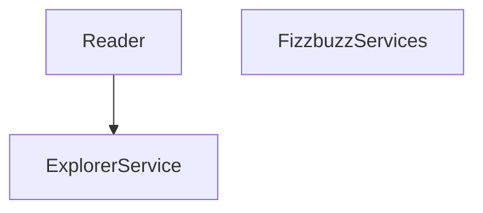
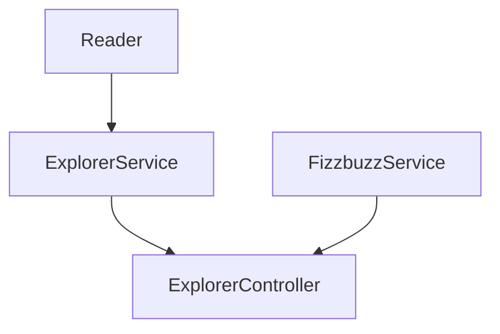
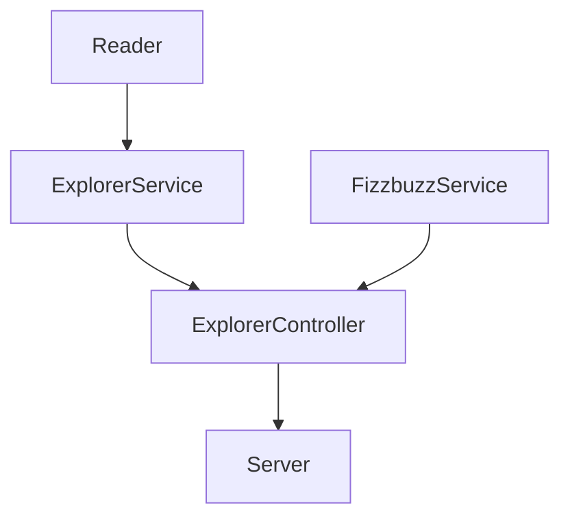

## Semana 4 NodeJS

```mermaid
graph TD;
    Reader-->ExplorerService;
    FizzbuzzServices;
```

```mermaid
graph TD;
    Reader-->ExplorerService;
    FizzbuzzService;
    ExplorerService-->ExplorerController
    FizzbuzzService-->ExplorerController
```

```mermaid
graph TD;
    Reader-->ExplorerService;
    FizzbuzzService;
    ExplorerService-->ExplorerController
    FizzbuzzService-->ExplorerController
    ExplorerController-->Server
```